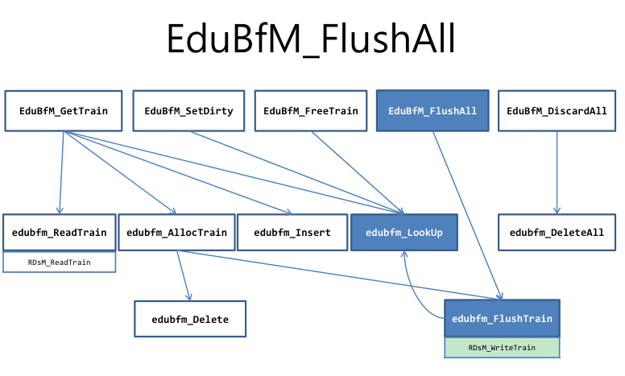

# EduBfM Report

Name: 김재진

Student id: 20180340

# Problem Analysis

## EduBfM_Internal.h

```c
/*@
 * Constant Definitions
 */ 
/* number of buffer types : number of buffer pools used */
#define NUM_BUF_TYPES 2

/* Buffer Types */
#define PAGE_BUF     0
#define LOT_LEAF_BUF 1

/* Macro: IS_BAD_BUFFERTYPE(type)
 * Description: check whether the buffer type is invalid
 * Parameter:
 *  Four type       : buffer type
 * Returns: TRUE(1) if the buffer type is invalid, otherwise FALSE(0)
 */
#define IS_BAD_BUFFERTYPE(type) (type < 0 || type >= NUM_BUF_TYPES)
```

Buffer Pool 타입에 대한 상수와 매크로이다. EduBfM에서 Buffer Pool은 두 종류이며 각 BufferPool 마다 별도의 bufInfo 구조체가 선언된다.  PAGE_BUF 타입과 LOT_LEAT_BUF 타입으로 두 종류이다. 

- PAGE_BUF 타입의 Buffer Pool은 하나의 page의 데이터 영역보다 작은 객체를 저정하는 page buffer pool이다.
- LOT_LEAT_BUF 타입의 Buffer Pool은 하나의 page의 데이터 영역보다 큰 객체를 나타내는 Large Object Tree의 Leaf Node를 저장하기 위한 train buffer pool이다. Large Object Tree의 Leaf Node는 현재 4개의 page로 구성된다.

```c
/* The structure of key type used at hashing in buffer manager */
/* same as "typedef BfMHashKey PageID; */
typedef struct {
    PageNo pageNo;		/* a PageNo */
    VolNo volNo;		/* a volumeNo */
} BfMHashKey;

/* Macro: SET_NILBFMHASHKEY(key)
 * Description: set pageNo of the hash key to NIL
 * Parameter:
 *  BfMHashKey key  : hash key
 */
#define SET_NILBFMHASHKEY(key) (SET_NILPAGEID(key))

/* Macro: IS_NILBFMHASHKEY(key)
 * Description: check whether pageNo of the hash key is NIL
 * Parameter:
 *  BfMHashKey key  : hash key
 * Returns: TRUE(1) if pageNo of the hash key is NIL, otherwise FALSE(0)
 */
#define IS_NILBFMHASHKEY(key)  (IS_NILPAGEID(key))

/* Macro: CHECKKEY(k)
 * Description: check whether the hash key is invalid
 * Parameter:
 *  BfMHashKey *k    : pointer to the hash key
 */
#define CHECKKEY(k)  \
	        { if( ((k)->volNo < 0) || ((k)->pageNo < 0) )  \
				              return( eBADHASHKEY_BFM ); }

/* Macro: EQUALKEY(k1, k2)
 * Description: check whether the two hash keys are equal
 * Parameters:
 *  BfMHashKey *k1   : pointer to the hash key
 *  BfMHashKey *k2   : pointer to the hash key
 * Returns: TRUE(1) if k1 is equal to k2, otherwise FALSE(0)
 */
#define EQUALKEY(k1, k2) \
          (((k1)->volNo == (k2)->volNo) && ((k1)->pageNo == (k2)->pageNo))
```

- BfMHashKey에 대한 상수와 매크로이다. BfMHashKey 구조체와 PageID 구조체 서로 동일한 멤버 변수를 가지고 있어 형변환이 가능하다. SET_NILBFMHASHKEY (key) 매크로가 SET_NILPAGEID (key) 매크로로 치환될 수 있다. IS_NILBFMHASHKEY (key) 매크로도도 마찬가지다.
- volNo와 pageNo는 음수가 될 수 없다. 0을 포함한 양수 값이다. 따라서 CHECKKEY (k) 매크로는 이를 검사하여 만약 volNo와 pageNo 중 둘 중 하나라도 음수 값이라면 eBADHASHKEY_BFM 에러 코드를 반환한다.
- EQUALKEY (k1, k2) 매크로는 BfMHashKey 구조체의 volNo 멤버와 pageNo 멤버 둘 다 동일한 지 비교하여 만약 그렇다면 TRUE(1)을 반환하고, 아니라면 FALSE(0)을 반환한다.

```c
/* The structure of BufferTable which is used in buffer replacement algo. */
typedef struct {
    BfMHashKey 	key;		/* identify a page */
    Two    	fixed;		/* fixed count */
    One    	bits;		/* bit 1 : DIRTY, bit 2 : VALID, bit 3 : REFER, bit 4 : NEW */
    Two    	nextHashEntry;
} BufferTable;

#define DIRTY  0x01
#define VALID  0x02
#define REFER  0x04
#define ALL_0  0x00
#define ALL_1  ((sizeof(One) == 1) ? (0xff) : (0xffff))
```

BufferTable 구조체의 정의하였고, DIRTY, VALID, REFER flag를 정의하였다. 0x00과 0xff (0b11111111)을 나타내는 flag인 ALL_0과 ALL_1을 정의하였다. ALL_1 flag는 user-defind type ONE이 1byte라면 0xff, 아니라면 0xffff 로 정의되었다. 

```c
~~/*~~ type definition for buffer pool information */
typedef struct {
    Two                 bufSize;        /* size of a buffer in page size */
    UTwo                nextVictim;     /* starting point for searching a next victim */
    Two                 nBufs;          /* # of buffers in this buffer pool */
    BufferTable*	 	bufTable;
    char*		 		bufferPool;	/* a set of buffers */
    Two*       		 	hashTable;	/* hash table */
} BufferInfo;

/* Macro: BI_BUFSIZE(type)
 * Description: return the size of a buffer element of a buffer pool (unit: # of pages)
 * Parameter:
 *  Four type       : buffer type
 * Returns: (Two) size of a buffer element
 */
#define BI_BUFSIZE(type)	     (bufInfo[type].bufSize)

/* Macro: BI_NBUFS(type)
 * Description: return the number of buffer elements of a buffer pool
 * Parameter:
 *  Four type       : buffer type
 * Returns: (Two) the number of buffer elements
*/
#define BI_NBUFS(type)           (bufInfo[type].nBufs)

/* Macro: BI_NEXTVICTIM(type)
 * Description: return an array index of the next buffer element(next victim) 
								to be visited to determine whether or not to replace the buffer element 
								by the buffer replacement algorithm
 * Parameter:
 *  Four type       : buffer type
 * Returns: (UTwo) an array index of the next victim
 */
#define BI_NEXTVICTIM(type)	     (bufInfo[type].nextVictim)
```

BufferInfo 구조체를 정의하였다.  아래 매크로는 BufferInfo 구조체의 멤버 중 bufSize, nBuf, nextVictim을 Buffer Pool의 *type* 별로 반환하는 기능을 한다. 

- bufSize: Buffer Pool의 Buffer Element의 크기(사이즈)를 나타낸다. 여기서 사이즈는 page 단위이다.
- nBuf: Buffer Pool에 있는 Buffer Element의 개수를 나타낸다.
- nextVictim: Buffer Repleacement Algorithm에서 Buffer Element의 교체 여부를 판별하기 위해서 방문해야하는, 다음 Buffer Element의 array index 값을 나타낸다.

```c
 /* Macro: BI_KEY(type, idx)
 * Description: return the hash key of the page/train residing in the buffer element
 * Parameters:
 *  Four type       : buffer type
 *  Four idx        : array index of the buffer element
 * Returns: (BfMHashKey) hash key
 */
 #define BI_KEY(type, idx)	     (((BufferTable*)bufInfo[type].bufTable)[idx].key)

/* Macro: BI_FIXED(type, idx)
 * Description: return the number of transactions fixing (accessing) the page/train residing in the buffer element
 * Parameters:
 *  Four type       : buffer type
 *  Four idx        : array index of the buffer element
 * Returns: (Two) number of transactions
 */
#define BI_FIXED(type, idx)	     (((BufferTable*)bufInfo[type].bufTable)[idx].fixed)

/* Macro: BI_BITS(type, idx)
 * Description: return a set of bits indicating the state of the buffer element
 * Parameters:
 *  Four type       : buffer type
 *  Four idx        : array index of the buffer element
 * Returns: (One) set of bits
 */
#define BI_BITS(type, idx)	     (((BufferTable*)bufInfo[type].bufTable)[idx].bits

/* Macro: BI_NEXTHASHENTRY(type, idx)
 * Description: return the array index of the buffer element containing the next page/train having the identical hash key value
 * Parameters:
 *  Four type       : buffer type
 *  Four idx        : array index of the buffer element containing the current page/train
 * Returns: (Two) array index of the buffer element containing the next page/train
 */
#define BI_NEXTHASHENTRY(type, idx)  (((BufferTable*)bufInfo[type].bufTable)[idx].nextHashEntry)
```

BufferInfo 구조체에는 BufferTable* bufTable이라는 포인터 멤버 변수가 있다. bufTable 포인터를 활용하여, Buffer Table 구조체의 멤버에 접근하는 매크로들이다. type과 idx에 대응하는 값이 전달되도록 호출하면, 원하는 Buffer Element에 대한 key, fixed, bits, nextHashEntry 멤버의 값을 얻을 수 있다. 

```c
/* Macro: BI_BUFFERPOOL(type)
 * Description: return the buffer pool
 * Parameter:
 *  Four type       : buffer type
 * Returns: (char *) pointer to the buffer pool
 */
#define BI_BUFFERPOOL(type)	     (bufInfo[type].bufferPool)

/* Macro: BI_BUFFER(type, idx)
 * Description: return the idx-th element of the buffer pool
 * Parameters:
 *  Four type       : buffer type
 *  Four idx        : array index of the buffer element
 * Returns: (char *) pointer to the idx-th element
 */
#define BI_BUFFER(type, idx)	     ((char*)BI_BUFFERPOOL(type)+PAGESIZE*BI_BUFSIZE(type)*idx)
```

- BI_BUFFERPOOL(type) 매크로는 타입 별 BufferInfo 구조체에 접근하여, char *bufferPool 포인터의 값을 반환하여, Buffer Pool의 시작 주소를 얻는 매크로이다.
- BI_BUFFER(type, idx)는 Buffer Pool의 idx 번째 Buffer Element의 주소를 반환하는 매크로이다. 바로 위에서 등장한 BI_BUFFERPOOL(type)으로 타입 별 Buffer Pool의 주소를 얻고, PAGESIZE * BI_BUFSIZE(type)을 통해 타입 별 Buffer Element의 크기(1 page size vs 4 page size)를 얻고, 그 값에 idx를 곱하여 idx 번째 Buffer Element의 주소를 얻을 수 있다.

```c
/* Macro: BI_HASHTABLE(type)
 * Description: return the hash table
 * Parameter:
 *  Four type       : buffer type
 * Returns: (Two*) pointer to the hash table
 */
#define BI_HASHTABLE(type)	     (bufInfo[type].hashTable)

/* Macro: BI_HASHTABLEENTRY(type,idx)
 * Description: return the idx-th element of the buffer table
 * Parameters:
 *  Four type       : buffer type
 *  Four idx        : array index of the buffer table element
 * Returns: (Two) idx-th element
 */
#define BI_HASHTABLEENTRY(type,idx)  (*(BI_HASHTABLE(type) + idx))

/* The size of the hash table is three times of the size of the buffer pool
 * in order to minimize the rate of collisions.
 * Each entry of the hash table corresponds to an index of the buffer pool
 * as well as the buffer table.
 */

/* Macro: HASHTABLESIZE_TO_NBUFS(_x)
 * Description: return the size of the hash table (unit: # of elements)
 * Parameter:
 *  Two _x          : size of the buffer pool (unit: # of elements)
 * Returns: (Two) size of the hash table
 */
#define HASHTABLESIZE_TO_NBUFS(_x)   	((_x) * 3 - 1) 	

/* Macro: HASHTABLESIZE(type)
 * Description: return the size of the hash table
 * Parameter:
 *  Four type       : buffer type
 * Returns: (Two) size of the hash table
 */
#define HASHTABLESIZE(type) 	     	(HASHTABLESIZE_TO_NBUFS(BI_NBUFS(type))) 

/* constant definition: The BfMHashKey don't exist in the hash table. */
#define NOTFOUND_IN_HTABLE  -1

extern BufferInfo bufInfo[];
```

- `BI_HASHTABLE(type)`은 타입 별 BufferInfo 구조체의 Two* hashTable 포인터 멤버에 접근하는 매크로이다. 이것으로 Hash Table의 주소 값을 얻을 수 있다.
- `BI_HASHTABLE_ENTRY(type, idx)`은 먼저, `BI_HASHTABLE(type) + idx`로 Hash Table의 idx 번째 entry의 주소에 접근한다. `*(BI_HASHTABLE(type) + idx)`로 값을 역참조하면, idx 번째 Hash Table Entry 값을 얻을 수 있다.
- `HASHTABLESIZE(type)`
    - `BI_NBUFS(type)`은 Buffer Pool 타입 별 Buffer Pool을 구성하는 Buffer Element의 개수를 반환한다.
    - 만약 Buffer Pool에 10개의 Buffer Element가 있다면, `HASHTABLESIZE_TO_NBUFS(10)`이 전달되어 `29`가 반환된다.
    - Hash Table은 Buffer Pool의 크기보다 3배 크다. 이는 Hash Table 내의 충돌(collison) 비율을 줄이기 위함이다.
- Hash Table 내에 `BfMHashKey` 값에 대응하는 value가 존재하지 않는 상황을 `NOTFOUND_IN_HTABLE` 매크로로 정의한다.
- `extern BufferInfo bufInfo[]` 에서 `extern` 키워드는 `BufferInfo` 타입의 배열인 `bufInfo`를 선언하되, 이 변수가 현재 파일에서 정의되어 있지 않고 다른 파일에서 정의되었음을 알려준다.

- 만약 접근한 Buffer Element의 Refer 비트가 1이라면 0으로 세팅하고, Refer 비트가 0이라면 Victim Buffer Element로 선정한다.
- Victim Buffer Element의 dirty bit이 1이라면, 디스크로 flush 해야한다.
- Victim Buffer Element에 대응하는 BufTable Element를 초기화한다.

---

# Design For Problem Solving

## High Level


페이지를 Buffer Pool에 fix하는 GetTrain 함수이다. 편의상 Edu_, edu_ 접두사는 생략하겠다. 

LookUp 함수를 호출하여 인자로 받은 trainId에 해당하는 Buffer Element의 array index를 반환한다. 

만약 array index 값이 존재하지 않으면 먼저, AllocTrain 함수를 호출하여 Buffer Pool에서 교체할 Victim Buffer Element의 index를 선택한다. 

Insert 함수를 호출하여 Hash Table에 새로운 entry를 삽입한다. 마찬가지로 Hash Table 충돌을 고려한 nextHashEntry 값들 가리키는 연결 리스트가 잘 유지되도록 삭제해야 한다. ReadTrain 함수를 호출하여 RDsM_ReadTrain 내장 함수를 호출한다. 내장 함수를 통해 디스크에서 데이터를 읽어 교체할 Buffer Element에 저장한다. 

trainId에 해당하는 array index가 존재한다면, LookUp 함수를 통해 바로 해당하는 array index를 반환한다. 택한 Buffer Element의 fix 값을 1 증가시키고, Refer 비트를 1로 세팅한다. 마지막으로, 인자로 넘어온 retBuf가 택한 Buffer element의 주소 값을 가리키도록 한다. 


SetDirty 함수는 trainId를 인자로 받아서, 대응하는 Buffer Element의 Dirty Bit을 1로 세팅하는 기능을 한다. 

trainId로 검색을 하지 않고, LookUp 함수를 호출하여 trainId를 BfMHahsKey 형태로 변환하고 Hash Table을 통해 찾고자 하는 Buffer Element의 array index를 반환한다.  

array index가 존재한다면 해당 Buffer Element의 Dirty Bit을 1로 세팅한다. 


SetDirty 함수에서 했듯이, FreeTrain 함수에서도 LookUp 함수를 호출하여 trainId에 대응하는 Buffer Element의 array index를 획득한다. array index가 존재한다면 Buffer Element의 fix 값을 1만큼 감소시킨다. 단, fix 값이 0보다 작아지는 상황을 주의한다. fix 값의 최솟값은 0이다. 



FlushAll은 인자가 없는 함수이다. 모든 Buffer Pool 타입과 각 Buffer Pool의 Buffer Element를 순회하며 모두 디스크로 Flush 한다. 

FlushTrain 함수를 호출하며 해당 Buffer Element의 trainId와 타입을 인자로 전달한다. RDsM_WriteTrain 내장 함수를 호출하여 Buffer Element의 데이터를 디스크의 trainId 위치로 flush 한다. 


FlushAll 함수와 유사하게, DiscardAll 함수 역시 인자가 없는 함수이며 모든 Buffer Pool 타입과 각 Buffer Pool의 Buffer Element를 순회하며 전부 Discard한다. 

Buffer Element의 key.pageNo를 NIL로 변경하고, Bits도 모두 0으로 초기화한다. DeleteAll 함수를 호출하여 Hash Table의 모든 entry를 삭제한다. 


## Low Level
### 1. edu_LookUp 함수

인자로 BfMHashKey 타입 포인터 key와 type 값을 받는다. Hash Table에 key 값으로 접근하여 대응하는 Buffer Element의 array index를 반환하는 함수다. 

nextHashEntry 값을 가리키는 연결 리스트를 고려하는 것이 Hash Table 관련 함수의 key challenge라고 할 수 있다. key 값이 달라도 해쉬 값이 서로 같은 충돌이 발생할 수 있기에 nextHashEntry의 연결 리스트를 타고 넘어가며 인자로 들어온 key와 현재 Buffer Element의 key 값이 동일한지 체크해야 한다. 

### 2. edu_Delete 함수

인자로 BfMHashKey 타입 포인터 key와 type 값을 받는다. 에러 코드 외에 따라 반환하는 값은 없다. Entry 삭제 후, nextHashEntry의 연결 리스트가 잘 유지될 수 있게 끔 세팅해야 한다. 

1.  첫 번째 경우는 충돌이 발생하지 않은 경우이다. Hash Table의 Entry로 바로 접근한 Buffer Element의 nextHashEntry가 NIL인 경우다. 
    
    이 경우, 연결 리스트 구조를 특별히 수정할 필요가 없다. 기존 Hash Table의 Entry 값을 삭제만 하면 된다. 
    
2. 두 번째 경우는 충돌이 발생하여 연결 리스트 상 중간에 위치한 Buffer Element의 Entry (array index)를 삭제해야 하는 상황이다. 삭제해야할 Buffer Element의 array index를 `i`, 그리고 연결리스트에서 바로 전에 있는 Buffer Element의 array index를 `prev`라고 해보자. `BI_NEXTHASHENTRY(type, prev) = BI_NEXTHASHENTRY(type, i);` 코드를 통해 연결 리스트 구조를 유지하면서 노드를 삭제할 수 있다. 

### 3. edu_Insert 함수

인자로 BfMHashKey 타입 포인터 key와 Entry에 삽입할 array index 값인 index, 그리고 type 값을 받는다. 마찬가지로 Entry에 새로운 값을 삽입 후, nextHashEntry의 연결 리스트가 잘 유지될 수 있게 끔 세팅해야 한다. 

`*(BI_HASHTABLE(type) + hashValue) = index;` 코드를 통해 Hash Table Entry에 인자로 받은 index 값을 삽입한다. 

만약 충돌이 발생한 경우, `BI_NEXTHASHENTRY(type, index) = origianl_index;`  코드로index가 가리키는 Buffer Element의 nextHashEntry에 기존 array index 값을 넣어 연결 리스트가 유지되게 끔 한다. 이렇게 함으로써 인자로 받은 index가 nextHashEntry 연결리스트의 가장 앞에 오게 끔 만든다.

### 4. edu_ReadTrain & edu_FlushTrain 함수

ReadTrain 함수는 trainId 포인터, Buffer Element를 가리키는 aTrain 포인터, 그리고 type 값을 인자로 받는다. RDsM_ReadTrain 함수를 호출하여 디스크의 trainId에 저장된 데이터를 읽어서, aTrain이 가리키는 Buffer Element에 저장한다.

FlushTrain 함수는 디스크에 flush할 위치를 가리키는 trainId 포인터와 type 값을 인자로 받는다. 먼저 trainId를 BfMHashKey 형태로 변환하여 trainId에 대응하는 Buffer Element의 array index를 획득한다. 만약 그 Buffer Element가 Dirty 상태라면, RDsM_WriteTrain 함수를 호출하여 Buffer Element에 저장된 데이터를 디스크의 trainId 위치에 flush 한다. 이후 Dirty 비트를 0으로 clear한다.

### 5. edu_AllocTrain 함수

AllocTrain 함수가 먼저 하는 작업은 Victim Buffer Element를 선정하는 것이다. EduCosmos는 Second Chance 알고리즘은 Victim을 선정한다. Buffer Element를 순회할 출발 위치는  `BI_NEXTVICTIM(type)` 이다. 

fix 값이 0인 즉, 사용 중이지 않은 Buffer Element 중에서 Refer 비트가 0인 Element를 Victim으로 선정한다. 만약 Buffer Element의 Refer 비트가 1이라면 값을 0으로 바꾸어, 다음에 반복 시에 Victim으로 선정한다. 이러한 방식때문에 Second Chance 알고리즘이라 명명한다. 만약 모든 Buffer Element가 fix라면 Victim을 선정할 수 없기에 `eNOUNFIXEDBUF_BFM` 에러 코드를 반환한다. 

Victim Buffer Element를 선정하면 그 Element의 array index를 `vicitim` 변수에 저장한다. 만약 Victim이 Dirty 상태라면 FlushTrain 함수를 호출하여 디스크로 flush 한다. 그 다음, Victim의 Bit를 0으로 초기화하고, `BI_NEXTVICTIM(type) = ((victim + 1) % BI_NBUFS(type));` 코드로 nextVictim 값을 업데이트 한다.

그 다음 Hash Table에서 Victim Buffer Element의 array index에 해당하는 Entry를 삭제하기 위해 Delete 함수를 호출한다. 

모든 작업이 완료되면 `victim`을 반환한다. 

### 6. edu_DeleteAll 함수

Hash Table을 순회하며 모든 entry를 삭제한다. 따라서 모든 entry에 NIL 값을 할당한다.

---

# **Mapping Between Implementation And the Design**

### edubfm_LookUp

```c
    hashValue = BFM_HASH(key,type);
    i = BI_HASHTABLEENTRY(type, hashValue);
    if (i == NIL)
    {
        return (NOTFOUND_IN_HTABLE);
    }

    BfMHashKey *tmp_key = &BI_KEY(type, i);
    while (!EQUALKEY(key, tmp_key))
    {
        i = BI_NEXTHASHENTRY(type, i);
        if (i == NIL)
        {
            return (NOTFOUND_IN_HTABLE);
        }

        tmp_key =  &BI_KEY(type, i);
        CHECKKEY(tmp_key);
    }

    return i;
```

`BfMHashKey` 포인터인 `tmp_key` 변수를 선언했다. `nextHashEntry`연결 리스트를 탐색하며 현재 Buffer Element의 `key`값을 `tmp_key`포인터가 가리키게 하였고, `EQUAL_KEY(key, tmp_key)`로 서로 동일한 key인지 체크하였다. 

### edubfm_Delete

```c
    hashValue = BFM_HASH(key, type);
    i = BI_HASHTABLEENTRY(type, hashValue); // array index of bufTable element
    // hash table entry is already NIL
    if (i == NIL)
    {
        return (eNOERROR);
    }

    BfMHashKey *tmp_key = &BI_KEY(type, i);
    CHECKKEY(tmp_key);

    /* no collison exits */
    if (BI_NEXTHASHENTRY(type, i) == NIL)
    {
        if (EQUALKEY(key, tmp_key))
        {
            *(BI_HASHTABLE(type) + hashValue) = NIL;
        }
        else 
        {
            ERR (eNOTFOUND_BFM);
        }
    }
```

충돌이 발생하지 않는 경우는 Hash Table Entry 값만 삭제한다. 

```c
    else /* collison happens */
    {
        while (1)
        {
            prev = i;
            i = BI_NEXTHASHENTRY(type, i);
            if (i == NIL)
            {
                ERR (eNOTFOUND_BFM);
            }

            tmp_key = &BI_KEY(type, i);
            CHECKKEY(tmp_key);
            if (EQUALKEY(key, tmp_key))
            {
                BI_NEXTHASHENTRY(type, prev) = BI_NEXTHASHENTRY(type, i);
                break;
            }
        }
    }
```

충돌이 발생한 경우에는 nextHashEntry 연결리스트를 이동하면서 삭제하고자 하는 Buffer Element를 찾는다. prev는 이전 Buffer Element array index를 가지고 있다. `BI_NEXTHASHENTRY(type, prev) = BI_NEXTHASHENTRY(type, i);` 코드로 연결 리스트 상에서 Entry를 삭제하고 `break;` 로 while 문을 빠져 나온다. 

### edubfm_Insert

```c
    if( (index < 0) || (index > BI_NBUFS(type)) )
        ERR( eBADBUFINDEX_BFM );

    hashValue = BFM_HASH(key, type);
    i = BI_HASHTABLEENTRY(type, hashValue); // original array index 
    *(BI_HASHTABLE(type) + hashValue) = index; // replace hash table entry with input array index

    /* case that original array index exists, which means collison exists */
    if (i != NIL) 
    {
        BI_NEXTHASHENTRY(type, index) = i;
    }
    
    return( eNOERROR );
```

Low Level 디자인을 직관적으로 수행한 코드이다. 

### edubfm_DeleteAll

```c
Four edubfm_DeleteAll(void)
{
    Two 	i;
    Four        tableSize;

    for (Four type = 0; type < 2; type++)
    { 
        tableSize = HASHTABLESIZE(type);
        for (i = 0; i < tableSize; i++)
        {
            *(BI_HASHTABLE(type) + i) = NIL;
        }
    }

    return(eNOERROR);

} /* edubfm_DeleteAll() */ 

```

`HASHTABLESIZE` 매크로로 Hash Table의 크기를 획득한다. 이후, 테이블을 순회하며 Entry를 모두 NIL로 변경한다. 

### edubfm_AllocTrain

```c
    /* Second chance algorithm for selecting victim buffer element */
    i = BI_NEXTVICTIM(type); 
    while (1)
    {
        if (BI_FIXED(type, i) == 0)
        {
            if (BI_BITS(type, i) & REFER) // Check Refer bit is 1
            {
                BI_BITS(type, i) = (BI_BITS(type, i) & (~REFER));
            }
            else // If Refer bit is 0 
            {
                break;
            }
        }
        else 
        {
            fixCount += 1;
            if (fixCount == BI_NBUFS(type))
            {
                ERR (eNOUNFIXEDBUF_BFM);
            }
        }

        i = (i + 1) % BI_NBUFS(type);
    }
```

Second Chance Algoirthm의 구현부다. fixCount 변수를 선언하여서 모든 Buffer Element가 fix인 경우를 감지하고 적절한 에러 코드를 반환한다. 

```c
    victim = i;
    if (BI_BITS(type, victim) & DIRTY) 
    {
        e = edubfm_FlushTrain((TrainID*)&BI_KEY(type, victim), type);
        if (e < 0) ERR (e);
    }

    BI_BITS(type, victim) = ALL_0;
    BI_NEXTVICTIM(type) = ((victim + 1) % BI_NBUFS(type));

    /* Do not delete hash entry of discarded buffer element which pageNo is NIL */
    if (BI_KEY(type, victim).pageNo != NIL)
    {
        e = edubfm_Delete(&BI_KEY(type, victim), type);
        if (e < 0) ERR (e);
    }

    return( victim );
```

이후 코드는 Low Level 디자인을 직관적으로 수행한 코드이다. 

### EduBfM_GetTrain

```c
    index = edubfm_LookUp((BfMHashKey *)trainId, type);
    if (index == NOTFOUND_IN_HTABLE)
    {
        index = edubfm_AllocTrain(type);
        if (index < 0) ERR(index);

        BI_KEY(type, index) = *((BfMHashKey*)trainId);
        e = edubfm_Insert(&BI_KEY(type, index), index, type);
        if (e < 0) ERR(e);

        e = edubfm_ReadTrain(trainId, BI_BUFFER(type, index), type);
        if (e < 0) ERR(e);
    }

    BI_FIXED(type, index) += 1;
    BI_BITS(type, index) = (BI_BITS(type, index) | REFER);
    *retBuf = BI_BUFFER(type, index);

    return(eNOERROR);   /* No error */
```

EduBfM_GetTrain 함수의 구현부이다. High Level 디자인을 명시적으로 수행했다. 

### EduBfM_FreeTrain

```c
    index = edubfm_LookUp((BfMHashKey *)trainId, type);
    if (index != NOTFOUND_IN_HTABLE)
    {
        BI_FIXED(type, index) -= 1; 
        if (BI_FIXED(type, index) < 0) 
        {   
            printf("fixed counter is less than 0!!!\n");
            printf("trainId = {%d, %d}\n", trainId->volNo, trainId->pageNo);

            BI_FIXED(type, index) = 0;
        }
    }
    else 
    {
        ERR (eNOTFOUND_BFM);
    }
    
    return( eNOERROR );
```

EduBfM_FreeTrain 함수의 구현부이다. High Level 디자인을 명시적으로 수행했다. 

### EduBfM_SetDirty

```c
    index = edubfm_LookUp((BfMHashKey *)trainId, type);
    if (index != NOTFOUND_IN_HTABLE)
    {
        BI_BITS(type, index) = (BI_BITS(type, index) | DIRTY);
    }
    else 
    {
        ERR (eNOTFOUND_BFM);
    }

    return( eNOERROR );

```

EduBfM_SetDirty 함수의 구현부이다. High Level 디자인을 명시적으로 수행했다. 

### EduBfM_DiscardAll & EduBfM_FlushAll

```c
Four EduBfM_DiscardAll(void)
{
    Four 	e;			/* error */
    Two 	i;			/* index */
    Four 	type;			/* buffer type */

    for (type = 0; type < 2; type++)
    {
        for (i = 0; i < BI_NBUFS(type); i++)
        {
            BI_KEY(type, i).pageNo = NIL;
            BI_BITS(type, i) = ALL_0;
        }
    }

    e = edubfm_DeleteAll();
    if (e < 0) ERR (e);

    return(eNOERROR);

}  /* EduBfM_DiscardAll() 
```

```c
Four EduBfM_FlushAll(void)
{
    Four        e;                      /* error */
    Two         i;                      /* index */
    Four        type;                   /* buffer type */

    for (type = 0; type < 2; type++)
    {
        for (i = 0; i < BI_NBUFS(type); i++)
        {
            if (BI_BITS(type, i) & DIRTY)
            {
                e = edubfm_FlushTrain((TrainID *)&BI_KEY(type, i), type);
                if (e < 0) ERR (e);
            }
        }
    }

    return( eNOERROR );
    
}  /* EduBfM_FlushAll() */
```

두 함수는 모든 type에 해당하는 Buffer Pool을 삭제 혹은 flush 하는 함수이다. 따라서 이중 반복문 형태로 구현하였다.


