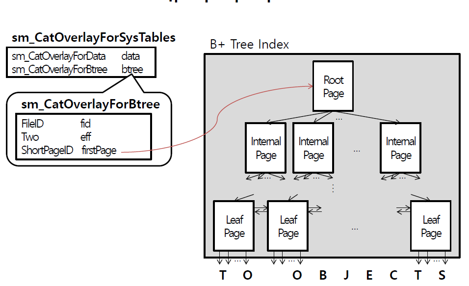

# EduBtM

# EduBtM Report

Name: 김재진

Student id: 2018040

# Problem Analysis

sm_CatOverlayForSysTables은 데이터 파일 및 관련 인덱스파일에 대한 정보를 저장한다. 멤버 필드인 sm_CatOverlayForBtree는 인덱스 파일에 대한 정보를 저장하기 위한 데이터 구조이다. firstPage 멤버 필드를 통해, B+ Tree 인덱스의 Root 페이지에 접근할 수 있다. 

BtreeLeaf는 B+ Tree 인덱스의 leaf node를 나타내는 페이지 데이터구조이다. BtreeLeafHdr는 BtreeLeaf에 대한 메타 정보를 저장하기 위한 헤더에 해당하는 데이터구조이다. BtM_LeafEntry는 B+ tree 인덱스의 leaf page에 저장되는leaf index entry를나타내는 데이터구조이다. 

BtreeInternal은 B+ Tree 인덱스의 internal node를 나타내는 페이지 데이터 구조이다. BtreeLeaf와 구조가 유사하다. 다음 / 이전 leaf page의 번호에 해당하는 prevPage / nextPage 멤버필드가 헤더에 없다는 것이 차이점이다. 

Btm_LeafEntry는 B+ tree 인덱스의 leaf page에 저장되는 leaf index entry를 나타내는 데이터구조이다. 

Btm_InternalEntry는 B+ tree 인덱스의 internal page에 저장되는 internal index entry를나타내는 데이터구조이다. 현재 index entry 이상이며 다음 index entry 미만인 index entry들이 저장된 자식 페이지의 번호에 해당하는 spid 필드가 존재한다. 

KeyValue는 B+ tree 인덱스에서 사용되는 키와 값 관련 정보를 저장하기위한 데이터구조이다. val 배열은 key를 구성하는 속성 값들의 sequence에 해당한다. EduBtM에서는 Integer type와 variable length string type만을 취급한다. 

KeyDesc는 키를 구성하는 속성 값들의 sequence에서 각 속성 값을 서로 구분하기 위한 정보를 저장하기위한 데이터구조이다. 

BtreeCursor는 B+ tree 인덱스의 leaf index entry를 가리키는 cursor를 나타내는 데이터구조이다.

# Design For Problem Solving

## High Level

EduBtM_CreateIndex 함수는 edubtm_InitLeaf 함수를 내부에서 호출한다. 

EduBtM_DropIndex 함수는 내부에서 edubtm_FreePages 함수를 호출한다.

EduBtM_InsertObject 함수는 dependency를 직관적으로 파악하기 쉽지 않다. 

EduBtM_InsertObject 함수는 어떤 노드에 삽입하는 지에 따라 흐름이 달라진다. root 노드면 edubtm_root_insert를, 그게 아니면 edubtm_Insert 함수를 호출한다. edubtm_Insert 함수는Internal node 혹은 leaf node에 대응하는 내부 함수를 호출한다. edubtm_SplitXX 함수를 호출하여 split되는 상황을 고려하고, edubtm_CompactXXPage를 호출하여 여유공간을 확보한다. 또한 edubtm_BinarySearchXX로 해당하는 찾고자 하는 key에 대응하는 노드를 확보한다.

EduBtM_DeleteObject 함수에서는 root 노드가 아닌 경우만을 고려한다. edubtm_Delete 함수를 호출하면 edubtm_insert와 마찬가지로 internal node와 leaf node에 대응하는 내부 함수를 호출하여 유사하게 처리한다. 

Edubtm_Fetch는 파라미터로 주어진 startCompOP에 따라서 호출하는 내부함수가 달라진다. 

Edubtm_FetchNext함수는 edubtm_FetchNext 함수를 호출하여 처리한다.

## Low Level
### External Function

EduBtM_CreateIndex()
이 함수는 Index file에서 새로운 B+ tree index를 생성하고, 생성된 index의 root page의 page ID를 반환하는 함수이다. 먼저 page를 할당 받고, edubtm_InitLeaf()로 할당 받은 page를 root page로 초기화하였다. 그 후 초기화된 root page의 page ID를 반환 받는다. 

EduBtM_DropIndex()
이 함수는 index file에서 B+ tree index를 삭제하는 함수이다. edubtm_FreePages() 함수를 통해 B+ tree index의 root page 및 모든 자식 page들을 각각 deallocate하였다.

EduBtM_InsertObject()
이 함수는 B+ tree index에 새로운 object를 삽입하는 함수이다. edubtm_Insert() 함수를 통해 새로운 object에 대한 key, ID pair을 Index에 삽입하였다. 그 후 root page에서 split이 발생하여 새로운 root page 생성이 필요하다면, 즉 Ih == TRUE라면 edubtm_root_insert()를 호출하여 이를 처리한다. 

EduBtM_DeleteObject()
이 함수는 B+ tree index에서 object를 삭제하는 함수이다. 먼저 edubtm_Delete 함수를 통해 key, ID pair을 삭제한다. 그 후, root page에서 underflow가 발생하였다면 btm_root_delete() 함수를 통해 처리하였다. 다음으로 root page에서 split이 발생한 경우, edubtm_root_insert()를 호출하여 처리하였다.

EduBtM_Fetch
이 함수는 B+ tree index에서 검색 조건을 만족하는 첫 번째 object를 검색하고 이의 cursor를 반환한다. 먼저 startCompOp가 SM_BOF라면 edubtm_FirstObject를 통해 가장 작은 key값을 갖는 leaf index를 검색한다. 다음으로 startCompOp가 SM_EOF라면 가장 큰 key값을 갖는 leaf index를 검색한다. 이외의 경우에는 edubtm_Fetch()를 호출하여 검색 조건을 만족하는 첫 번째 leaf index를 반환한다.

EduBtM_FetchNext
이 함수는 검색 조건을 만족하는 현재 object의 다음 object를 검색하고, 검색된 object를 가리키는 cursor를 반환한다. 먼저 edubtm_FetchNext()를 호출하여 검색 조건을 만족하는 다음 leaf index를 검색하였다.

### Internal Function

edubtm_InitLeaf()
이 함수는 page를 leaf page로 초기화하는 함수이다. Page의 header에서 type, pid, nSlots, free, unused, prevPage, nextPage등을 초기화한다.

edubtm_InitInternal()
이 함수는 page를 internal page로 초기화하는 함수이다. Page의 header에서 pid, flags, type, p0, nSlots, free, unused 등을 초기화한다.

edubtm_FreePages()
이 함수는 index page를 deallocate하는 함수이다. 이는 파라미터로 주어진 page의 모든 자식
page들에 대해 재귀적으로 edubtm_FreePages()를 호출하여 해당 page들을 deallocate한다.

edubtm_Insert()
이 함수는 parameter로 주어진 page를 root page로 하는 index에 새로운 object에 대한 Key, ID pair을 삽입하고, root page에서 split이 발생한 경우, split으로 생성된 새로운 page를 가리키는 internal index entry를 반환한다. 먼저 주어진 page가 internal page라면 새로운 object를 삽입할 leaf page를 찾기 위해서 다음으로 방문할 child page를 결정한다. 그리고 이 자식 page에 새로운 object를 삽입하기 위해 재귀적으로 edubtm_Insert()를 호출하였다. 만약 결정된 자식 page에서 split이 발생한 경우, 해당 split으로 생성된 새로운 page를 가리키는 internal index entry를 파라미터로 주어진 root page에 삽입한다. 만약 파라미터로 주어진 root page에서 split이 발생하였다면 해당 split으로 생성된 새로운 page를 가리키는 internal index entry를 반환한다. 다음으로 파라미터로 주어진 root page가 leaf page라면 edubtm_InsertLeaf()를 호출하여서 해당 page에 새로운 object를 삽입하였다. 만약 split이 발생하였다면 해당 split으로 생성된 새로운 page를 가리키는 internal index entry를 반환하였다.

edubtm_InsertLeaf()
이 함수는 leaf page에 새로운 index entry를 삽입하고, split이 발생한 경우, split으로 새엉된 새로운 leaf page를 가리키는 internal index entry를 반환한다. 먼저 새로운 index entry의 삽입 위치를
결정한다. 그리고 새로운 index entry 삽입을 위해 필요한 free area의 크기를 계산하였다. 다음으로 page에 여유 영역이 있는 경우, 필요 할 때는 page를 compact 하고, 결정된 slot 번호로 새로운 index entry를 삽입하였다. 다음으로 page에 여유 영역이 없다면 이는 page overflow가 발생한 경우이므로 edubtm_SplitLeaf()를 호출하여 page를 split하였다.

edubtm_InsertInternal()
이 함수는 Internal page에 새로운 index entry를 삽입하고, split이 발생한 경우 split으로 생성된 새로운 Internal page를 가리키는 internal index entry를 반환한다. 이를 위해 먼저 새로운 index entry 삽입을 위하여 필요한 free area의 크기를 계산하였다. 다음으로 page에 여유 영역이 있는 경우 필요한 경우 page를 compact하고, 파라미터로 주어진 slot 번호의 다음 slot 번호로 새로운 index entry를 삽입하였다. 다음으로 page에 여유 영역이 없는 경우에는 page overflow가 발생한 경우이므로 edubtm_SplitInternal()을 호출하여 page를 split하였다.

edubtm_SplitLeaf()
이 함수는 overflow가 발생한 leaf page를 split하여 파라미터로 주어진 index entry를 삽입하고, split으로 생성된 새로운 leaf page를 가리키는 internal index entry를 반환한다. 이를 위해 먼저 새로운 page를 할당 받고 그 page를 leaf page로 초기화하였다. 그 후, 기존 index entry들 및 삽입할 index entry를 key 순으로 정렬하여 overflow가 발생한 page 및 할당 받은 page에 나누어 저장하였다. 다음으로 할당 받은 page를 leaf page들간의 doubly linked list에 추가하고 할당 받은 page를 가리키는 internal index entry를 생성하였다. 마지막으로 split된 page가 ROOT일 경우, type을 LEAF로 변경하고 생성된 index entry를 반환하였다.

edubtm_SplitInternal()
이 함수는 overflow가 발생한 internal page를 split하여 파라미터로 주어진 index entry를 삽입하고 split으로 생성된 새로운 internal page를 가리키는 internal index entry를 반환하는 함수이다. 
이를 위해 먼저 새로운 page를 할당 받고 그 page를 internal page로 초기화하였다. 그리고 기존 index entry들 및 삽입할 index entry를 key 순으로 정렬하여 overflow가 발생한 page 및 할당 받은 page에 나누어 저장하였다. 다음으로 split된 page가 ROOT일 경우, type을 INTERNAL로 변경하였다.

edubtm_root_internal
이 함수는 Root page가 split된 색인을 위한 새로운 root page를 생성하는 함수이다 . 먼저 새로운 page를 할당 받고, 기존 root page를 할당 받은 page로 복사한다. 그리고 기존 root page를 새로운 root page로서 초기화하였고 할당 받은 page와 root page split으로 생성된 page가 새로운 root page의 자식 page들이 되도록 설정하였다.

edubtm_Delete()
이 함수는 파라미터로 주어진 page를 root page로 하는 색인에서 object를 삭제한다. 먼저 파라미터로 주어진 page가 internal page라면 삭제할 object를 찾기 위해 다음으로 방문할 자식 page를 결정한다. 그리고 결정된 자식 page를 root page로 하는 subtree에서 재귀적으로 edubtm_Delete()를 호출하였다. 마지막으로 결정된 자식 page에서 underflow가 발생한 경우, btm_Underflow()를 호출하여 이를 처리하였다. 다음으로 파라미터로 주어진 root page가 leaf page인 경우 edubtm_DeleteLeaf()를 호출하여 해당 page에서 object를 삭제하였다.

edubtm_DeleteLeaf()
이 함수는 leaf page에서 object를 삭제하는 함수이다. 먼저 삭제할 object가 저장된 index의 offset이 저장된 slot을 삭제하였다. 그 후 leaf page의 header을 갱신하고 underflow가 발생한 경우 f를 TRUE로 설정하였다.

edubtm_CompactLeafPage()
이 함수는 Leaf page의 데이터 영역의 모든 free area가 연속된 하나의 continuous free area가 되도록 index entry들의 offset을 조정하는 함수이다. 먼저 파라미터로 주어진 slotNo가 NIL이 아니라면 slotNo에 대응하는 page의 모든 index entry들을 데이터 영역의 가장 앞부분부터 연속되게 저장하였다. 다음으로 파라미터로 주어진 slotNo가 NIL인 경우 page의 모든 index entry들을 데이터 영역의 가장 앞부분부터 연속되게 저장하였다. 그 후, page header을 갱신하였다.

edubtm_CompoactInteralPage()
이 함수는 Internal page의 데이터 영역의 모든 자유 영역이 연속된 하나의 continuous free area를 형성하도록 index entry들의 offset을 조정하였다. 먼저 파라미터로 주어진 slotNo가 NIL이 아니라면 slotNo에 대응하는 page의 모든 index entry들을 데이터 영역의 가장 앞부분부터 연속되게 저장하였다. 다음으로 파라미터로 주어진 slotNo가 NIL인 경우 page의 모든 index entry들을 데이터 영역의 가장 앞부분부터 연속되게 저장하였다. 그 후, page header을 갱신하였다.

edubtm_Fetch()
이 함수는 파라미터로 주어진 page를 root page로 하는 index에서 첫 번째 object가 저장된 leaf index entry를 검색하고, 검색된 leaf index entry를 가리키는 cursor을 반환한다. 첫 번째 object는, 검색 조건을 만족하는 object들 중 검색 시작 key값과 가장 가까운 key값을 가지는 object를 의미한다. 먼저 파라미터로 주어진 root page가 internal page인 경우, 검색 조건을 만족하는 첫 번째 object가 저장된 leaf page를 찾기 위해 다음으로 방문할 자식 page를 결정한다. 그리고 결정된 자식 page를 root page로 하는 subtree에서 재귀적으로 edubtm_Fetch()를 호출하였다. 다음으로 파라미터로 주어진 root page가 leaf page인 경우, 검색 조건을 만족하는 첫 번째 object가 저장된 index entry를 검색하였다.

edubtm_FetchNext()
이 함수는 검색 조건을 만족하는 현재 leaf index entry의 다음 leaf index entry를 검색하고, 검색된 leaf index entry를 가리키는 cursor을 반환한다. 검색 조건이 SM_GT, SM_GE일 경우, key값이 작아지는 방향으로 backward scan을 하고, 그 외의 경우 key값이 커지는 방향으로 forward scan을 한다.

edubtm_FirstObject()
이 함수는 가장 작은 key값을 갖는 leaf index entry를 검색하는 함수이다.

edubtm_LastObject()
이 함수는 가장 큰 key값을 갖는 leaf index entry를 검색하는 함수이다.

edubtm_BinarySearchLeaf()
이 함수는 leaf page에서 파라미터로 주어진 key값보다 작거나 같은 key값을 갖는 index entry를 검색하고, 검색된 index entry의 위치를 반환한다.

edubtm_BinarySearchInternal()
이 함수는 Internal page에서 파라미터로 주어진 key값보다 작거나 같은 key값을 갖는 index를 검색하고, 검색된 index entry의 위치를 반환한다.

edubtm_KeyCompare()
이 함수는 파라미터로 주어진 두 key값의 대소를 비교하고 결과를 반환하는 함수이다. 이 떄, Variable length string 의 경우에는 사전식 순서를 이용하여 비교한다.

# Mapping Between Implementation And the Design

위의 항목에서 서술한 내용을 바탕으로 코드를 구현하였다. 코드가 너무 많아 분량 상 부득이하게 코드를 첨부하지 못한 점에 대해 양해를 부탁드린다. 